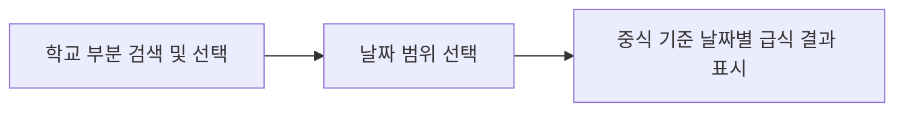

# PRD: 급식 배틀 - 학교 급식 조회 앱

## 1. 개요

- **앱 제목**: 급식 배틀 - 학교 급식 조회 앱
- **문서 목적**: 이 문서(PRD)는 앱이 무엇을, 왜, 어떤 흐름으로 동작해야 하는지를 정의하는 제품 요구사항의 단일 기준(single source of truth)입니다. 구체적인 구현 방식은 [`TRD.md`](./TRD.md)에서 다룹니다.
- **한 줄 소개**: NEIS 공개 API를 활용해 사용자가 원하는 학교와 날짜 범위의 급식 메뉴(중식 기준)를 조회하는 웹 애플리케이션입니다.

## 2. 개발 목적

- 학생, 학부모, 교직원이 특정 학교의 급식 정보를 빠르고 간편하게 확인할 수 있도록 합니다.
- NEIS에서 제공하는 [공개 API](./data/openapi.json)를 활용해 신뢰할 수 있는 급식 데이터를 제공합니다.
- 학교 검색부터 결과 확인까지 3단계로 단순화한 사용자 흐름을 통해 누구나 쉽게 사용할 수 있는 경험을 제공합니다.

## 3. 대상 사용자

| 사용자 유형 | 주요 요구 |
|-------------|-----------|
| 학생 | 오늘/이번 주 우리 학교 급식 메뉴를 빠르게 확인 |
| 학부모 | 자녀 학교의 날짜별 급식 메뉴 확인 |
| 교직원 | 특정 기간의 급식 식단을 조회하고 참고 |

## 4. 사용자 흐름 (3단계)

앱은 다음 3단계의 사용자 흐름으로 구성합니다.

1. **학교 검색 및 선택**: 사용자가 학교 이름의 일부만 입력해 학교를 검색하고, 검색 결과 목록에서 원하는 학교를 선택합니다.
2. **날짜 범위 선택**: 급식을 조회할 시작일과 종료일(날짜 범위)을 선택합니다.
3. **급식 결과 표시**: 선택한 학교와 날짜 범위에 대해 **중식(점심) 기준**의 날짜별 급식 메뉴를 표시합니다.

## 5. 기능 요구사항

### FR-1. 부분 학교명 검색
- 사용자는 학교 이름의 일부만 입력해 학교를 검색할 수 있다.
- 검색 결과는 학교명, 소재지 등 학교를 식별할 수 있는 정보와 함께 목록으로 표시된다.

### FR-2. 학교 선택
- 사용자는 검색 결과 목록에서 하나의 학교를 선택할 수 있다.
- 선택한 학교는 이후 급식 조회의 대상이 된다.

### FR-3. 날짜 범위 선택
- 사용자는 급식을 조회할 시작일과 종료일을 선택할 수 있다.
- 시작일은 종료일보다 이후일 수 없다.

### FR-4. 급식 조회 및 표시
- 사용자는 선택한 학교와 날짜 범위로 급식 조회를 요청할 수 있다.
- 조회 결과는 **중식 기준**으로 날짜별 급식 메뉴를 표시한다.
- 각 날짜의 메뉴 정보를 사용자가 읽기 쉬운 형태로 표시한다.

## 6. 예외 상황 (Edge Cases)

| 예외 상황 | 기대 동작 |
|-----------|-----------|
| **검색 결과 없음** | 입력한 학교명과 일치하는 학교가 없을 때, 결과가 없음을 알리는 안내 메시지를 표시한다. |
| **잘못된 날짜 범위** | 시작일이 종료일보다 이후이거나 유효하지 않은 날짜를 선택한 경우, 조회를 막고 오류를 안내한다. |
| **급식 정보 없음** | 선택한 학교와 날짜 범위에 급식 정보가 없을 때(예: 주말·공휴일·방학), 해당 날짜에 급식 정보가 없음을 안내한다. |
| **외부 API 오류** | NEIS API 호출 실패 또는 응답 지연 시, 사용자에게 일시적인 오류임을 알리고 재시도를 유도한다. |

## 7. 범위 밖 (Out of Scope)

- 조식·석식 등 중식 이외의 급식 구분 표시
- 급식 메뉴 비교/분석 등 부가 기능(후속 단계에서 다룸)
- 사용자 계정 및 개인화 기능

## 8. 인수 조건

- [ ] 학교 이름의 일부만으로 학교를 검색하고 선택할 수 있다.
- [ ] 날짜 범위를 선택할 수 있으며 잘못된 범위는 차단된다.
- [ ] 선택한 학교와 날짜 범위에 대해 중식 기준 날짜별 급식이 표시된다.
- [ ] 검색 결과 없음, 잘못된 날짜 범위, 급식 정보 없음 등 예외 상황이 적절히 처리된다.
