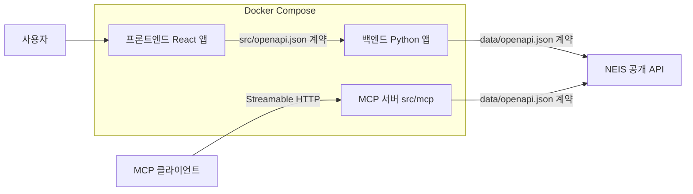

# TRD: 급식 배틀 - 학교 급식 조회 앱

## 1. 개요

이 문서(TRD)는 [`PRD.md`](./PRD.md)에서 정의한 요구사항을 실제로 구현하기 위한 기술 설계를 기술합니다. 애플리케이션은 **프론트엔드 UI 앱**, **백엔드 API 앱**, **MCP 서버**로 구성하며, 세 앱은 **Docker Compose**로 오케스트레이션합니다.

## 2. 아키텍처

- 프론트엔드는 **직접 NEIS API를 호출하지 않으며**, 오직 백엔드 API 앱과만 통신합니다.
- 백엔드는 NEIS API를 호출해 데이터를 가공한 뒤 프론트엔드에 전달하는 중계·가공 계층 역할을 합니다.
- MCP 서버는 백엔드와는 별개로 실행되며, NEIS API를 직접 호출해 MCP 클라이언트에게 학교 검색·급식 조회 도구를 제공합니다.

### 2.1 API 계약 (OpenAPI)

두 종류의 OpenAPI 명세를 구분해 사용합니다.

| 명세 | 위치 | 용도 |
|------|------|------|
| 외부 API 명세 | [`data/openapi.json`](./data/openapi.json) | 백엔드/MCP 서버 ↔ NEIS API 통신 계약 |
| 내부 API 명세 | `src/openapi.json` (신규 생성) | 프론트엔드 ↔ 백엔드 통신 계약 |

- **`src/openapi.json`**: 프론트엔드가 백엔드와 통신하기 위한 엔드포인트와 데이터 스키마를 정의합니다. 백엔드가 노출하는 학교 검색·급식 조회 엔드포인트를 이 문서로 명세합니다.
- 프론트엔드와 백엔드는 각각 `src/openapi.json` / `data/openapi.json` 명세를 근거로 별도의 클라이언트 코드를 구현합니다.
- MCP 서버는 `data/openapi.json` 명세를 근거로 NEIS API 통신용 클라이언트 코드를 별도로 구현하며, `src/openapi.json`(프론트엔드-백엔드 계약)과는 무관하게 동작합니다.

## 3. 프론트엔드

- **기술 스택**: React 기반 SPA. UI 표현을 담당합니다.
- **책임**
  - `PRD.md`의 3단계 사용자 흐름(학교 검색 → 날짜 선택 → 결과 표시)을 화면으로 구현합니다.
  - 백엔드 API만 호출하며, NEIS API를 직접 호출하지 않습니다.
  - `src/openapi.json` 명세를 근거로 백엔드 통신용 클라이언트 코드를 구현합니다.
- **주요 화면/컴포넌트**
  1. 학교 검색 컴포넌트: 부분 학교명 입력 및 결과 목록/선택
  2. 날짜 범위 선택 컴포넌트: 시작일·종료일 선택 및 유효성 검사
  3. 급식 결과 컴포넌트: 중식 기준 날짜별 메뉴 표시
- **예외 처리 (UI)**: 검색 결과 없음, 잘못된 날짜 범위, 급식 정보 없음, API 오류 등의 상태를 사용자에게 명확한 메시지로 표시합니다.

## 4. 백엔드

- **기술 스택**: Python 기반 API 서버.
- **책임**
  - NEIS API(`data/openapi.json` 명세 기준)를 호출해 학교 기본정보와 급식식단정보를 조회합니다.
  - `data/openapi.json` 명세를 근거로 NEIS API 통신용 클라이언트 코드를 구현합니다.
  - 조회 결과를 `src/openapi.json` 명세에 맞춰 가공한 뒤 프론트엔드에 전달합니다.
  - NEIS API 인증 키 등 민감 정보를 서버 측에서 관리하며 프론트엔드에 노출하지 않습니다.
- **NEIS API 연동**
  - 학교 검색: `schoolInfo` 엔드포인트로 부분 학교명(`SCHUL_NM`) 검색.
  - 급식 조회: `mealServiceDietInfo` 엔드포인트로 학교 코드(`ATPT_OFCDC_SC_CODE`, `SD_SCHUL_CODE`)와 날짜 범위(`MLSV_FROM_YMD`, `MLSV_TO_YMD`), 중식 구분(`MMEAL_SC_CODE`)을 사용해 조회.
- **예외 처리 (API)**: 검색 결과 없음, 급식 정보 없음, 잘못된 요청 파라미터, NEIS API 오류를 구분해 적절한 상태 코드와 오류 메시지로 응답합니다.

## 5. MCP 서버

- **위치**: `src/mcp`
- **기술 스택**: Python 기반, **Streamable HTTP** 트랜스포트를 사용하는 MCP 서버.
- **독립성**: 기존 백엔드 API 앱과는 별개의 프로세스·컨테이너로 실행되며, 백엔드를 경유하지 않고 NEIS API를 **직접 호출**합니다. `data/openapi.json` 명세를 근거로 NEIS API 통신용 클라이언트 코드를 구현합니다.
- **제공 도구**
  1. **학교 검색 도구**: 부분 학교명을 입력받아 NEIS `schoolInfo` 엔드포인트로 조회하고, 후보 학교의 이름·교육청 정보(`ATPT_OFCDC_SC_CODE` 등)·학교 식별 코드(`SD_SCHUL_CODE`)를 반환합니다.
  2. **급식 조회 도구**: 학교 식별 정보(`ATPT_OFCDC_SC_CODE`, `SD_SCHUL_CODE`)와 시작일·종료일을 입력받아 NEIS `mealServiceDietInfo` 엔드포인트를 중식 구분(`MMEAL_SC_CODE`) 기준으로 호출하고, 날짜별 급식 정보를 반환합니다.
  - MCP 클라이언트는 도구 목록 조회(list tools)를 통해 위 두 도구를 확인할 수 있습니다.
- **예외 처리 (MCP)**: 입력값 오류, 학교 검색 결과 없음, 급식 정보 없음, NEIS API 오류·응답 지연을 구분해 MCP 표준에 맞는 오류 응답으로 반환하며, NEIS API 인증 키 등 민감 정보는 오류 메시지에 포함하지 않습니다.

## 6. 데이터 흐름

1. 프론트엔드가 부분 학교명으로 백엔드의 학교 검색 API를 호출한다.
2. 백엔드가 NEIS `schoolInfo`를 호출해 학교 목록을 받아 프론트엔드에 반환한다.
3. 사용자가 학교와 날짜 범위를 선택하면, 프론트엔드가 백엔드의 급식 조회 API를 호출한다.
4. 백엔드가 NEIS `mealServiceDietInfo`를 중식 기준으로 호출해 날짜별 급식 데이터를 받아 가공 후 반환한다.
5. 프론트엔드가 날짜별 급식 결과를 화면에 표시한다.
6. MCP 클라이언트는 MCP 서버에 연결해 도구 목록을 조회하고, 학교 검색 도구를 호출하면 MCP 서버가 NEIS `schoolInfo`를 직접 호출해 후보 학교 정보를 반환한다.
7. MCP 클라이언트가 학교 식별 정보와 날짜 범위로 급식 조회 도구를 호출하면, MCP 서버가 NEIS `mealServiceDietInfo`를 중식 기준으로 직접 호출해 날짜별 급식 정보를 반환한다.

## 7. 배포 및 실행 구성

- 프론트엔드 앱, 백엔드 앱, MCP 서버를 각각 Docker 이미지로 빌드한다.
- **Docker Compose**로 세 서비스를 함께 정의해 빌드·실행·오케스트레이션한다.
  - 프론트엔드 서비스: React 앱을 서빙.
  - 백엔드 서비스: Python API 서버를 실행.
  - MCP 서버 서비스: `src/mcp`의 Python MCP 서버를 Streamable HTTP로 실행.
  - 서비스 간 네트워크를 구성해 프론트엔드가 백엔드 엔드포인트로 통신하도록 한다. MCP 서버는 백엔드와 독립적으로 실행되며 별도 네트워크 경로로 MCP 클라이언트의 연결을 받는다.
- NEIS API 키 등 환경 변수는 Compose의 환경 설정을 통해 백엔드 서비스와 MCP 서버 서비스에 각각 주입한다.

## 8. 테스트 전략

| 대상 | 테스트 종류 | 범위 |
|------|-------------|------|
| 프론트엔드 | 통합 테스트 | 컴포넌트 간 연동 및 백엔드 API(클라이언트) 연동 흐름 검증 |
| 백엔드 | 단위 테스트 | NEIS 클라이언트, 데이터 가공 로직, 유효성 검사 등 개별 단위 |
| 백엔드 | 통합 테스트 | 엔드포인트 요청/응답 및 NEIS 연동(모킹 포함) 검증 |
| MCP 서버 | 단위 테스트 | NEIS 클라이언트, 도구 입력 유효성 검사, 오류 응답 변환 로직 등 개별 단위 |
| MCP 서버 | 통합 테스트 | 도구 목록 조회·도구 호출 요청/응답 및 NEIS 연동(모킹 포함) 검증 |
| 전체 | E2E 테스트 | 학교 검색 → 날짜 선택 → 급식 결과 표시의 전체 사용자 흐름 검증 |

- 프론트엔드는 **통합 테스트만** 작성한다.
- 백엔드와 MCP 서버는 각각 **단위 테스트와 통합 테스트**를 모두 작성한다.
- 전체 사용자 흐름에 대한 **E2E 테스트**를 작성하며, 예외 상황(검색 결과 없음, 잘못된 날짜 범위, 급식 정보 없음)도 검증한다.

## 9. 인수 조건

- [ ] React 프론트엔드와 Python 백엔드의 책임이 정의되어 있다.
- [ ] 프론트엔드가 NEIS API를 직접 호출하지 않는다는 제약이 명시되어 있다.
- [ ] `data/openapi.json` 기반 외부 API 연동과 프론트엔드·백엔드 간 데이터 흐름이 정의되어 있다.
- [ ] Docker Compose 기반 빌드·실행 구성이 정의되어 있다.
- [ ] 프론트엔드 통합 테스트, 백엔드 단위·통합 테스트, 전체 흐름 E2E 테스트 전략이 명시되어 있다.
- [ ] `src/mcp`에 위치한 Streamable HTTP 기반 MCP 서버가 기존 백엔드와 독립적으로 실행되도록 정의되어 있다.
- [ ] 학교 검색 도구와 급식 조회 도구(중식 기준)의 입력·출력이 정의되어 있다.
- [ ] MCP 도구의 입력값 오류, 검색 결과 없음, 급식 정보 없음, NEIS API 오류·지연에 대한 MCP 표준 오류 응답 처리(민감 정보 비노출 포함)가 정의되어 있다.
- [ ] MCP 서버가 Docker Compose 구성에 포함되어 있으며, MCP 서버의 단위·통합 테스트 전략이 명시되어 있다.
