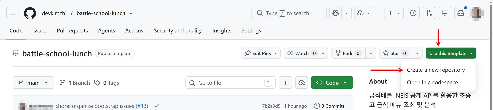
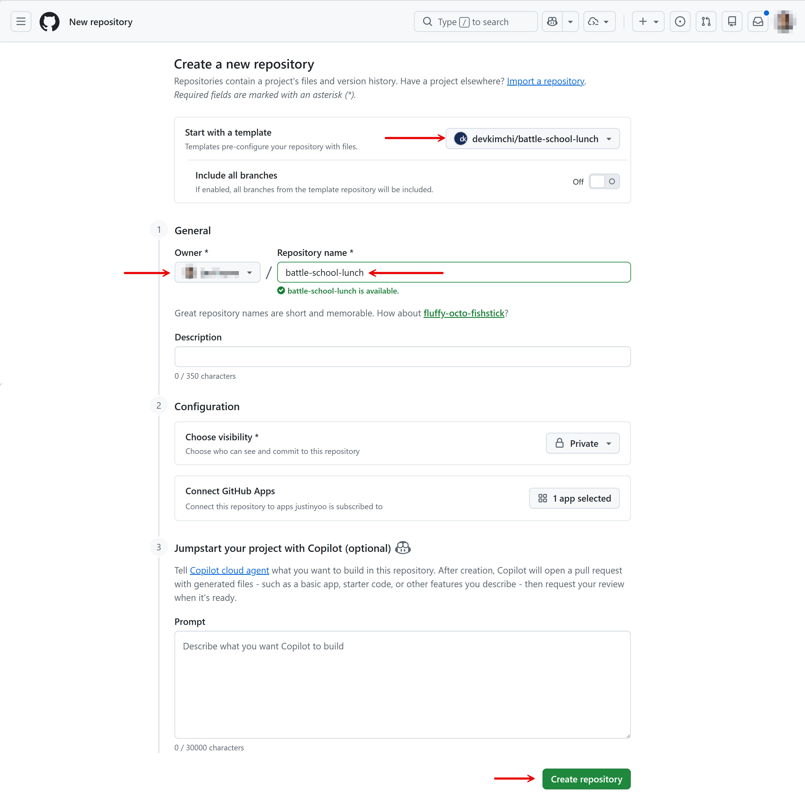
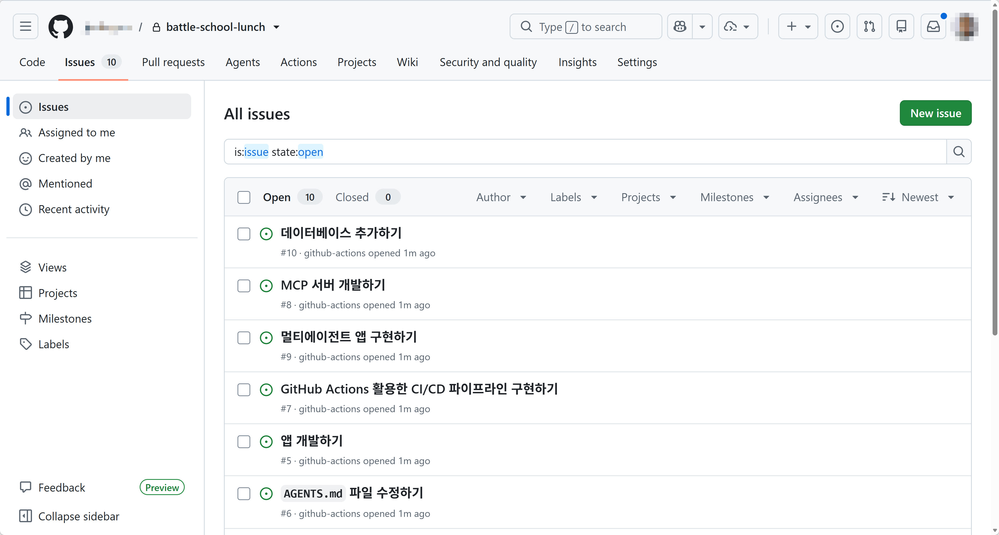
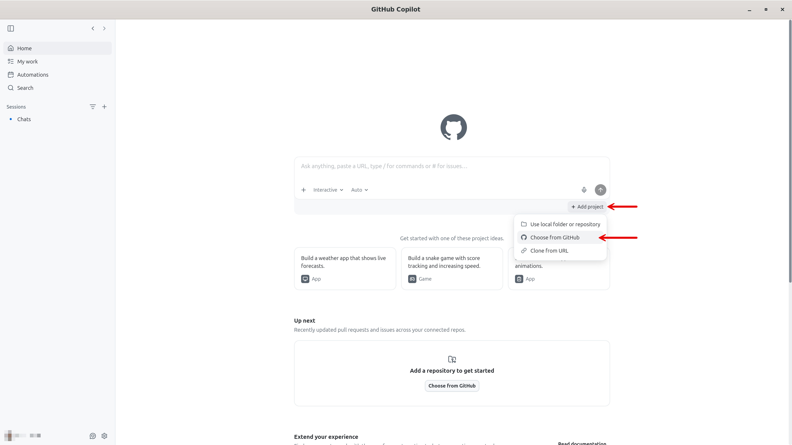
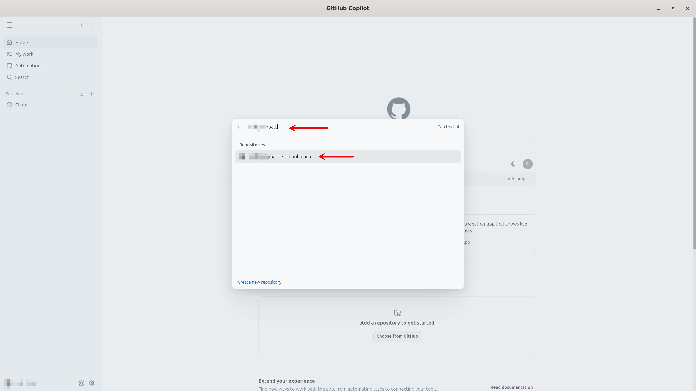
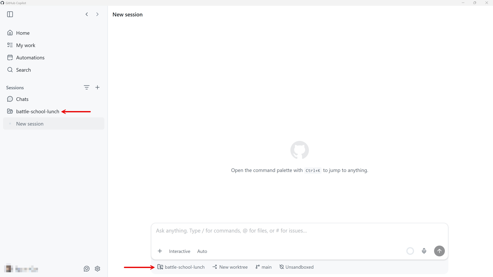
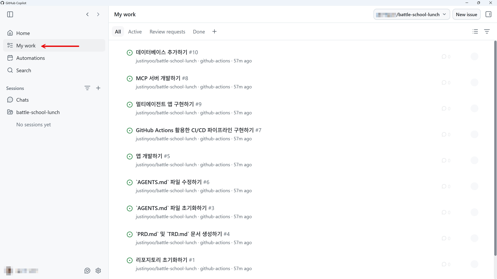

# 개발 환경 설정

이 세션에서는 이 워크샵을 진행하기 위해 필요한 개발 환경을 설정합니다.

## 개발 도구 설치

아래 페이지 링크를 클릭하여 안내에 따라 각 개발 도구를 설치합니다.

### GitHub Copilot 관련

- [GitHub Copilot app](https://gh.io/app)
- [GitHub Copilot CLI](https://gh.io/copilot-cli)
- [GitHub CLI](https://gh.io/cli)

> [!NOTE]
> 이미 설치가 되어 있다면, 가장 최신 버전으로 업데이트해 주세요.

### Azure 관련

- [Azure CLI](https://aka.ms/az-cli)
- [Azure Developer CLI](https://aka.ms/azd-cli)

> [!NOTE]
> 이미 설치가 되어 있다면, 가장 최신 버전으로 업데이트해 주세요.

## 개발 도구 로그인

### GitHub Copilot CLI

1. Copilot CLI 앱을 실행시킵니다.

    ```bash
    copilot
    ```

1. 슬래시 명령어로 로그인을 합니다.

    ```
    /login
    ```

1. 또는 한번에 할 수도 있습니다.

    ```bash
    copilot login
    ```

### GitHub CLI

1. 아래 명령어를 통해 로그인합니다.

    ```bash
    gh auth login
    ```

1. 로그인이 끝난 후 현재 로그인 상태를 확인합니다.

    ```bash
    gh auth status
    ```

   로그인 한 GitHub ID가 보여야 합니다.

### Azure CLI

1. 아래 명령어를 통해 로그인합니다.

    ```bash
    az login
    ```

   > **NOTE**: 만약 같은 계정으로 여러 개의 테넌트를 사용하고 있다면 아래와 같이 `--tenant` 정보를 추가해야 합니다.
   > 
   > ```bash
   > az login --tenant my-tenant.onmicrosoft.com
   > ```

1. 로그인 후 상태를 확인합니다.

    ```bash
    az account show
    ```

   로그인 한 테넌트 및 구독 정보가 보여야 합니다.

### Azure Developer CLI

1. 아래 명령어를 통해 로그인합니다.

    ```bash
    azd auth login
    ```

   > **NOTE**: 만약 같은 계정으로 여러 개의 테넌트를 사용하고 있다면 아래와 같이 `--tenant` 정보를 추가해야 합니다.
   > 
   > ```bash
   > azd auth login --tenant-id my-tenant.onmicrosoft.com
   > ```

1. 로그인 후 상태를 확인합니다.

    ```bash
    azd auth login --check-status
    ```

   로그인 한 계정이 보여야 합니다.

## 워크샵 리포지토리 생성

워크샵 리포지토리는 템플릿으로 설정해 두었으므로 포크하지 않고 직접 내 계정에 리포지토리를 생성할 수 있습니다.

1. [`https://github.com/devkimchi/battle-school-lunch-workshop`](https://github.com/devkimchi/battle-school-lunch-workshop) 리포지토리를 방문합니다.
1. 오른쪽 위의 "Use this template" 버튼을 클릭한 후 "Create a new repository" 메뉴를 클릭합니다.

   

1. 워크샵 리포지토리가 템플릿으로 되어 있는지 확인한 후, 리포지토리 오너 및 리포지토리 이름을 지정합니다. 여기서는 `battle-school-lunch`로 했지만, 원하는 이름 무엇이든 가능합니다. 이후 스크롤을 끝까지 내려 "Create repository" 버튼을 클릭합니다.

   

1. 새 리포지토리가 만들어진 후 Issues 탭을 확인해 보면 사전에 지정한 이슈가 이미 만들어져 있습니다.

   

## GitHub Copilot app 실행

1. Copilot 앱을 실행시킨 후 화면의 안내에 따라 로그인합니다.
1. 방금 생성한 워크샵 리포지토리를 추가합니다.

   

   

1. 앱의 왼쪽에 방금 추가한 리포지토리가 보입니다.

   

1. 앱의 왼쪽에 있는 "My work" 탭을 클릭하면 앞서 자동으로 생성된 이슈 리스트가 보입니다.

   

---

이제 개발 환경 설정을 마쳤습니다. [`openapi.json` 명세 생성하기](./01-generate-openapi.md)로 넘어가세요.
