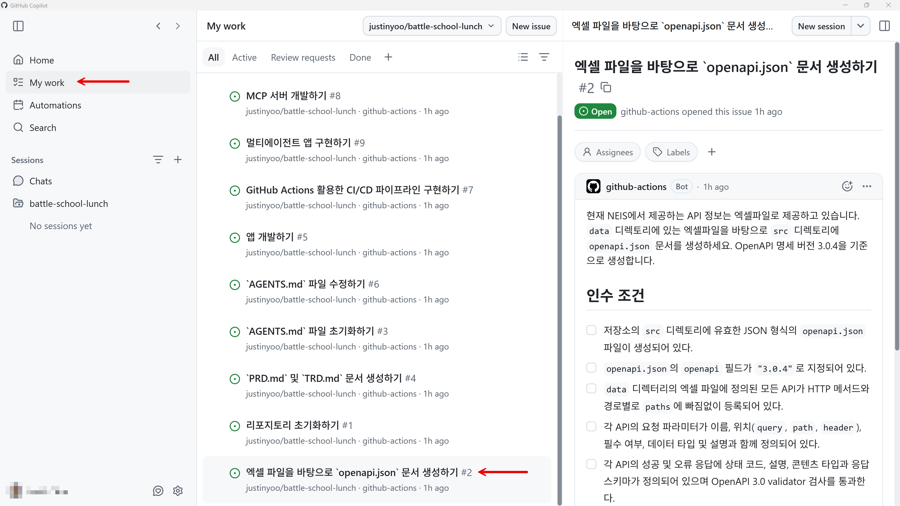
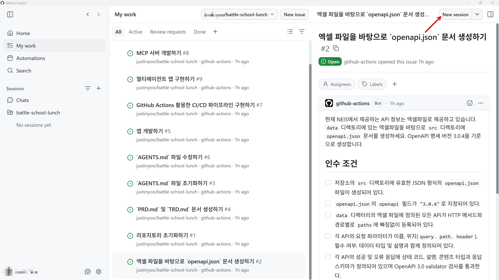
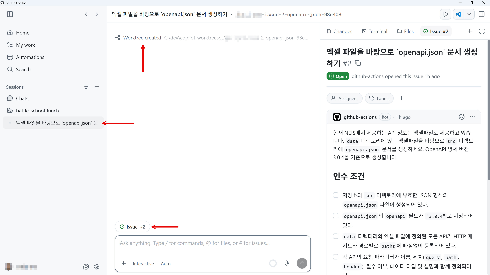
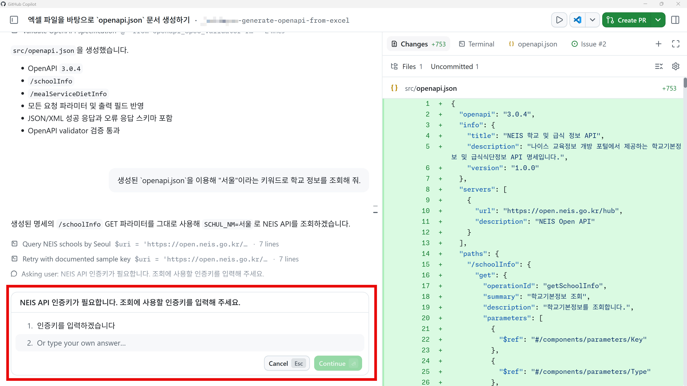
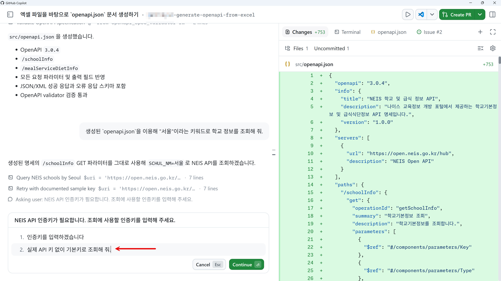
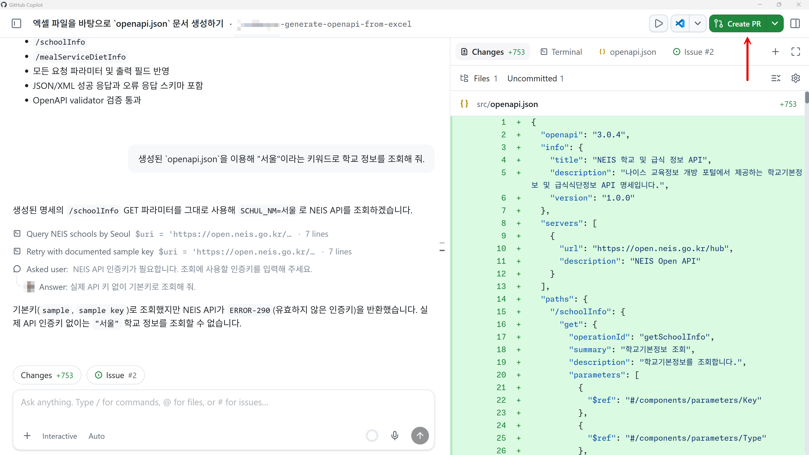
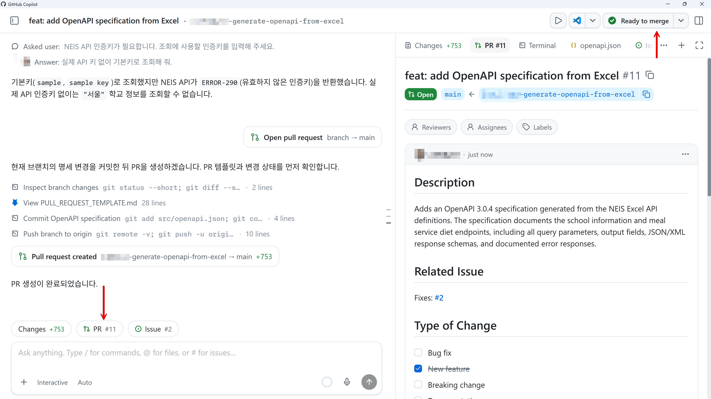
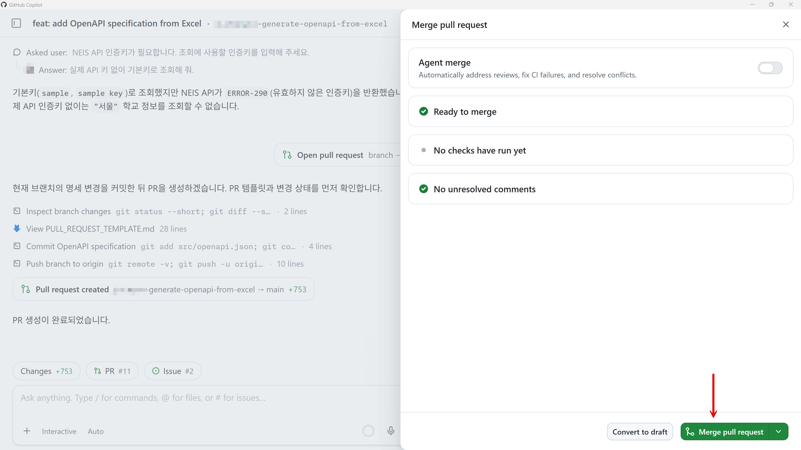
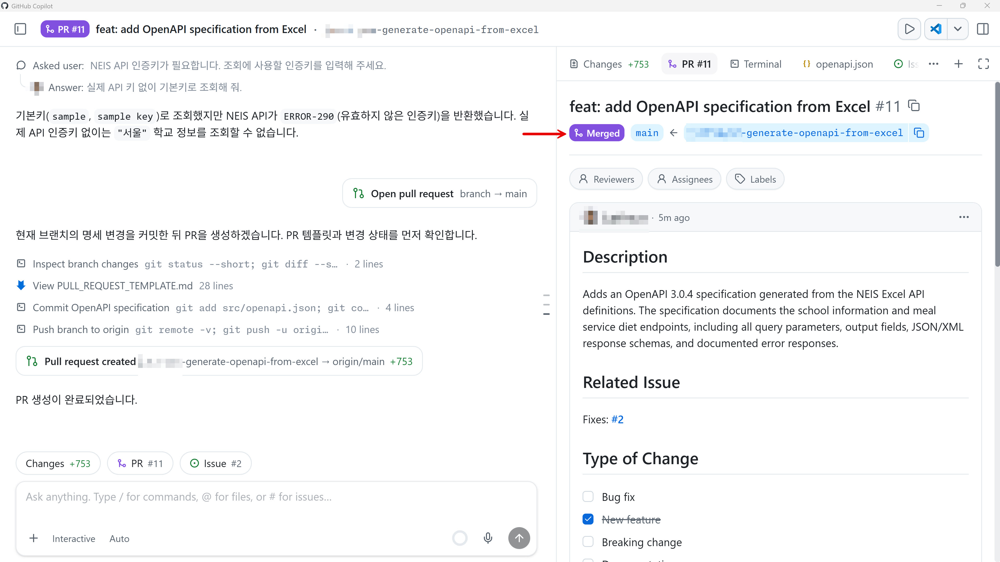

# `openapi.json` 명세 생성하기

현재 NEIS에서는 공개 API 정보를 엑셀파일의 형태로 제공하고 있습니다. 이 엑셀 파일을 읽어 우리 앱에서 사용할 수 있는 OpenAPI 명세 문서로 바꿔야 합니다. 이 세션에서는 Copilot app의 기능을 이용해서 엑셀파일을 `openapi.json` 문서로 변환합니다.

> [!NOTE]
> 현재 보이는 스크린샷은 시간이 지나면서 UI 업데이트로 인해 현재 시점과 다를 수 있습니다.

## API 액세스 키 생성하기

[NEIS 교육정보 개방 포털](https://open.neis.go.kr/)에서 API 키를 생성하세요. 회원 가입이 필요합니다.

> [!CAUTION]
> 생성한 API 키는 절대로 Copilot app의 세션 안에서 직접 사용하지 마세요. 별도의 시크릿 저장소를 이용해야 합니다.

## 이슈 확인하기

1. Copilot app의 "My work" 탭에서 현재 열려있는 모든 이슈를 확인한 후 그 중 "엑셀 파일을 바탕으로 `openapi.json` 문서 생성하기" 이슈를 클릭합니다.

   

1. 이슈의 내용과 이슈를 클로징하기 위해 필요한 인수 조건을 확인합니다.

## 세션 생성하기

1. 오른쪽 위의 "New session" 버튼을 클릭합니다.

   

1. 이 이슈를 근거로 하는 새로운 세션이 만들어졌습니다. 그리고 이 세션은 새로운 worktree를 기반으로 동작합니다. 따라서 기존의 코드베이스와 충돌하지 않습니다.

   

## 이슈 작업하기

1. 아래와 같이 프롬프트를 입력한 후 엔터키를 누릅니다.

    ```text
    엑셀파일에 정의되어 있는 모든 엔드포인트를 openapi.json 명세 문서로 변환시켜줘.
    ```

1. 작업이 끝나면 아래와 같이 `openapi.json` 파일이 만들어집니다.

   

1. 프롬프트에 아래와 같이 입력해서 제대로 작동하는지 테스트해 봅니다.

    ```text
    생성된 `openapi.json`을 이용해 "서울"이라는 키워드로 학교 정보를 조회해 줘.
    ```

1. 아래와 같이 API 키가 필요하다는 질문을 할 수도 있습니다. 그럴 경우 실제 API 키를 입력하지 말고 기본 키로 조회해 달라고 합니다.

   

    ```text
    실제 API 키 없이 기본키로 조회해 줘.
    ```

   

1. 인증키 없이는 작동하지 않는다는 메시지를 반환합니다. `openapi.json` 명세가 제대로 작동하는 것을 의미합니다. 오른쪽 위의 "Create PR" 버튼을 클릭해서 방금 작업한 내용을 바탕으로 PR을 생성합니다.

   

1. PR이 만들어졌고, 머지할 준비가 끝났습니다. "Ready to merge" 버튼을 클릭합니다.

   

1. 새 팝업 모달 창이 나타나면 "Merge pull request" 버튼을 클릭해서 방금 생성한 PR을 머지합니다.

   

1. 머지가 완료된 것을 확인합니다.

   

---

`openapi.json` 명세 문서를 생성했습니다. [`AGENTS.md` 문서 생성하기](./02-generate-agents-md.md)로 넘어가세요.
