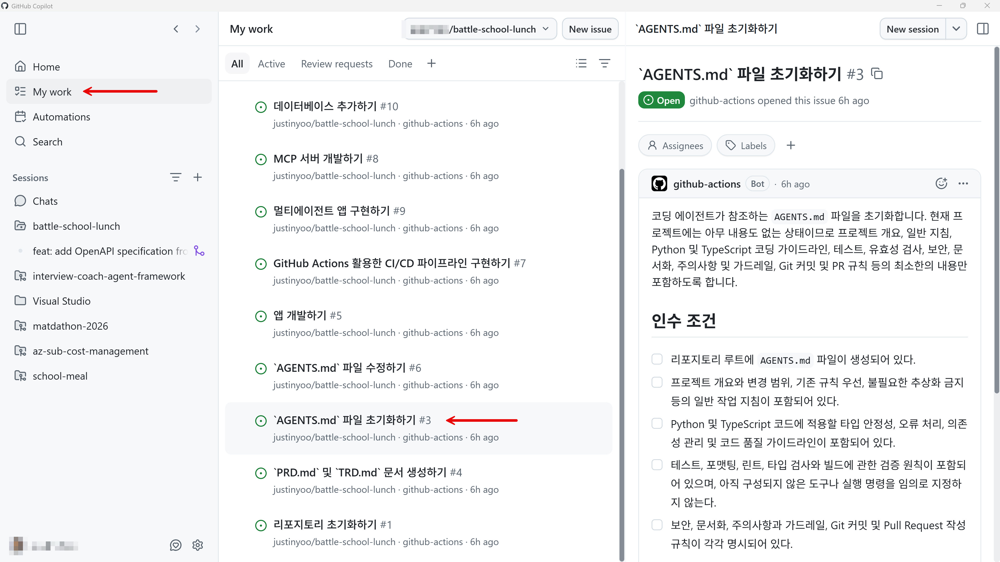
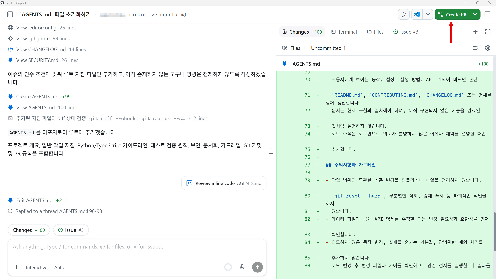

# `AGENTS.md` 문서 생성하기

`AGENTS.md` 파일은 GitHub Copilot과 같은 AI 코딩 에이전트가 읽고 이 프로젝트에서 무엇을 해야 하는지, 무엇을 하지 말아야 하는지를 정의하는 문서입니다. 이 세션에서는 아직 아무런 코드를 작성하지 않은 상태에서 기본적으로 GitHub Copilot이 어떻게 행동해야 하는지에 대해 정의하는 `AGENTS.md` 문서를 작성합니다.

> [!NOTE]
> 현재 보이는 스크린샷은 시간이 지나면서 UI 업데이트로 인해 현재 시점과 다를 수 있습니다.

## 이슈 확인하기

1. Copilot app의 "My work" 탭에서 현재 열려있는 모든 이슈를 확인한 후 그 중 "`AGENTS.md` 파일 초기화하기" 이슈를 클릭합니다.

   

1. 이슈의 내용과 이슈를 클로징하기 위해 필요한 인수 조건을 확인합니다.

## 세션 생성하기

1. 오른쪽 위의 "New session" 버튼을 클릭합니다.
1. 이 이슈를 근거로 하는 새로운 세션이 만들어졌습니다. 그리고 이 세션은 새로운 worktree를 기반으로 동작합니다. 따라서 기존의 코드베이스와 충돌하지 않습니다.

## 이슈 작업하기

1. 아래와 같이 프롬프트를 입력한 후 에이전트를 실행시킵니다.

    ```text
    이슈의 내용을 구현해 줘.
    ```

1. 작업이 끝나면 아래와 같이 `AGENTS.md` 파일이 만들어집니다.

   

1. 만들어진 `AGENTS.md` 파일을 검토하면서 수정이 필요하거나 추가할 내용이 있다면 아래와 같이 변경사항에 코멘트를 달아 요청합니다. 여기서는 PR 템플릿을 활용하라는 규칙을 추가해 달라고 요청합니다.

    ```text
    PR 템플릿을 반드시 활용해서 작성하라는 메시지도 추가해 줘
    ```

   

1. 새 요청사항이 반영이 된 것을 확인합니다.

   

   

1. 만족할 때 까지 `AGENTS.md` 파일의 내용을 수정한 후, 오른쪽 위의 "Create PR" 버튼을 클릭해서 방금 작업한 내용을 바탕으로 PR을 생성합니다.

   

1. PR이 만들어졌고, 머지할 준비가 끝났습니다. "Ready to merge" 버튼을 클릭합니다.
1. 새 팝업 모달 창이 나타나면 "Merge pull request" 버튼을 클릭해서 방금 생성한 PR을 머지합니다.
1. 머지가 완료된 것을 확인합니다.

---

`AGENTS.md` 문서를 생성했습니다. [PRD(Product Requirements Document) 및 TRD(Technical Requirements Document) 생성하기](./03-generate-prd-trd.md)로 넘어가세요.
