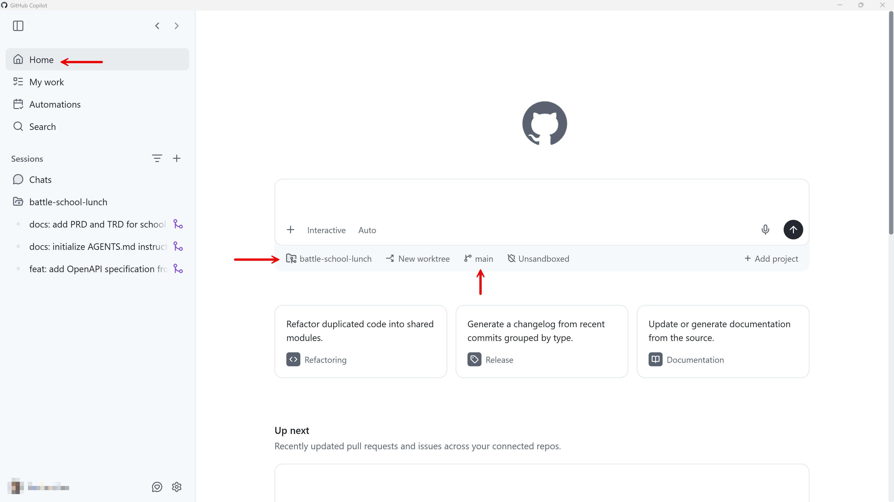
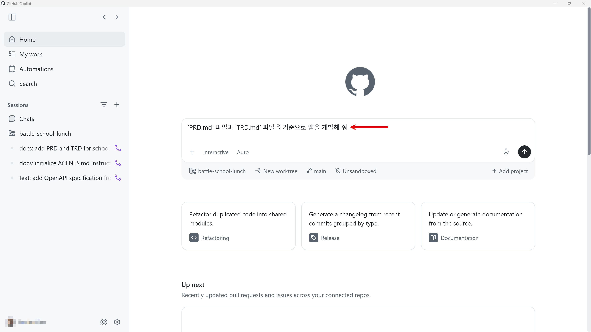
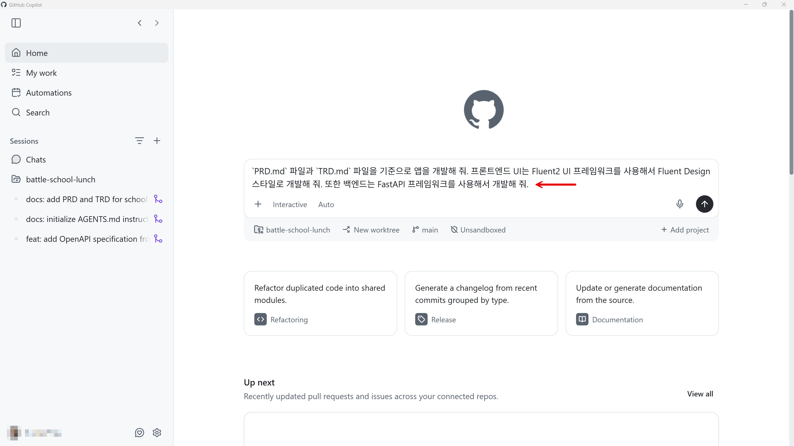
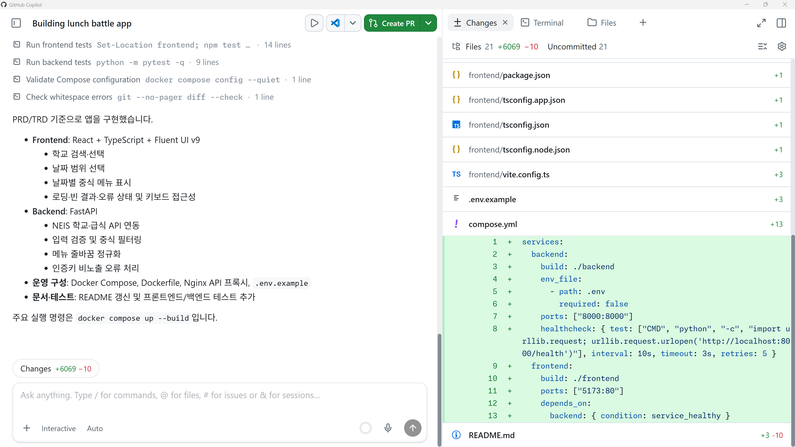
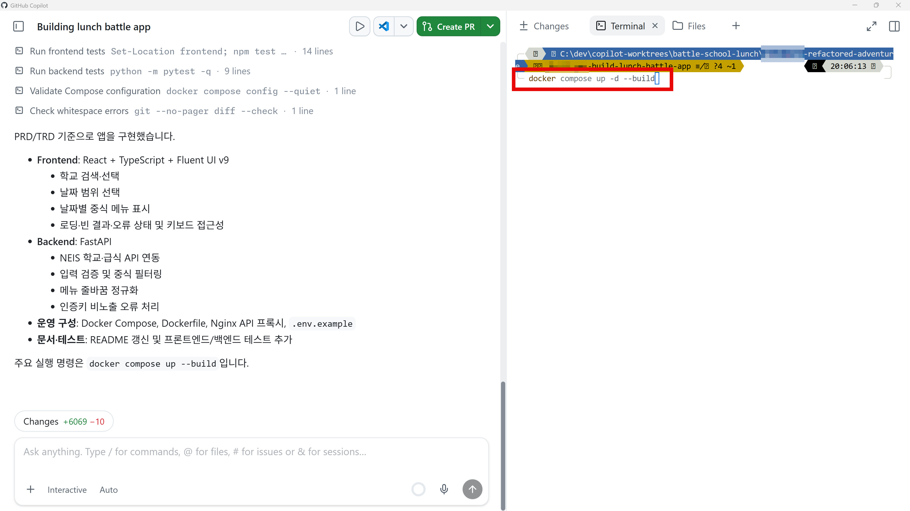
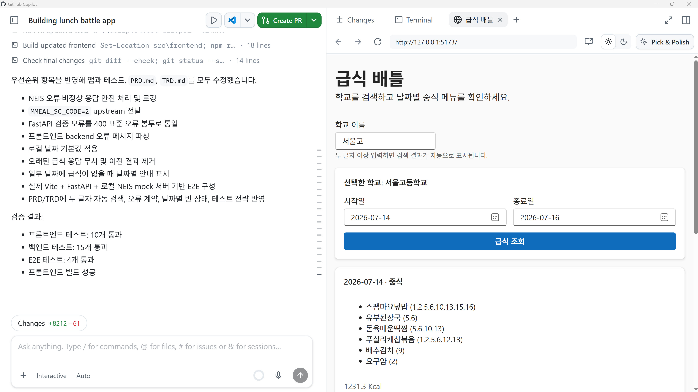

# 앱 개발하기

PRD와 TRD를 모두 준비했다면, 이제 실제로 앱을 개발할 차례입니다. 이 세션에서는 실제로 앱을 개발해 봅니다.

> [!NOTE]
> 현재 보이는 스크린샷은 시간이 지나면서 UI 업데이트로 인해 현재 시점과 다를 수 있습니다.

## 직접 프롬프트 입력하기

1. Copilot app의 "Home" 탭에서 리포지토리가 현재 작업하고 있는 리포지토리인지, 브랜치는 `main` 브랜치인지 확인합니다.

   

1. 아래와 같이 프롬프트를 입력합니다.

    ```text
    `PRD.md` 파일과 `TRD.md` 파일을 기준으로 앱을 개발해 줘.
    ```

   

   만약 PRD 또는 TRD에서 프론트엔드 UI 프레임워크나 백엔드 프레임워크에 대한 언급이 없다면, 아래와 같이 프롬프트를 추가해도 좋습니다.

    ```text
    `PRD.md` 파일과 `TRD.md` 파일을 기준으로 앱을 개발해 줘. 프론트엔드 UI는 Fluent UI 프레임워크를 사용해서 Fluent Design 스타일로 개발해 줘. 또한 백엔드는 FastAPI 프레임워크를 사용해서 개발해 줘.
    ```

   > UI 디자인 스타일을 가리키는 용어들이 다양하게 있습니다. Glass Design, Material Design, Flat Design, 스큐어모피즘 등 다양하게 있으니 구글링으로 찾아보고 원하는 디자인 스타일을 적용시켜보세요.

   

1. 구현 결과가 아래와 같이 나왔습니다.

   

1. 이후 터미널을 열어 코드를 직접 실행시켜 에러 없이 동작하는지 확인합니다. 앱 실행 방법을 모르면 프롬프트로 앱 실행 방법도 물어봅니다.

    ```text
    앱을 한번에 실행시킬 수 있는 스크립트를 pwsh과 bash로 작성해 줘.
    ```

   

   > **NOTE**: 앱을 실행시키기 전에 `.env.example` 파일을 `.env` 파일로 복사한 후 NEIS API 키를 저장해 두어야 합니다. 그렇지 않으면 백엔드 애플리케이션이 NEIS API를 호출하지 못합니다.

   원하는 대로 동작하지 않을 경우 반복해서 프롬프트로 수정 요청을 합니다.

1. 실제로 앱이 잘 동작하는 것을 확인합니다.

   

1. 앱 구현이 `PRD.md` 문서와 `TRD.md` 문서에 정의한 대로 되어 있는지 프롬프트를 통해 확인합니다.

    ```text
    `PRD.md` 와 `TRD.md` 문서와 현재 구현된 코드를 다시 한번 리뷰해 보고 구현하지 않은 것이 있는지, 너무 오버엔지니어링 한 것이 있는지 확인해 줘.
    ```

1. "Create PR" 버튼을 클릭하여 변경 사항을 PR로 생성한 후 머지합니다.
1. 머지가 완료된 것을 확인합니다.

---

앱을 구현했습니다. [`AGENTS.md` 문서 수정하기](./05-update-agents-md.md)로 넘어가세요.
