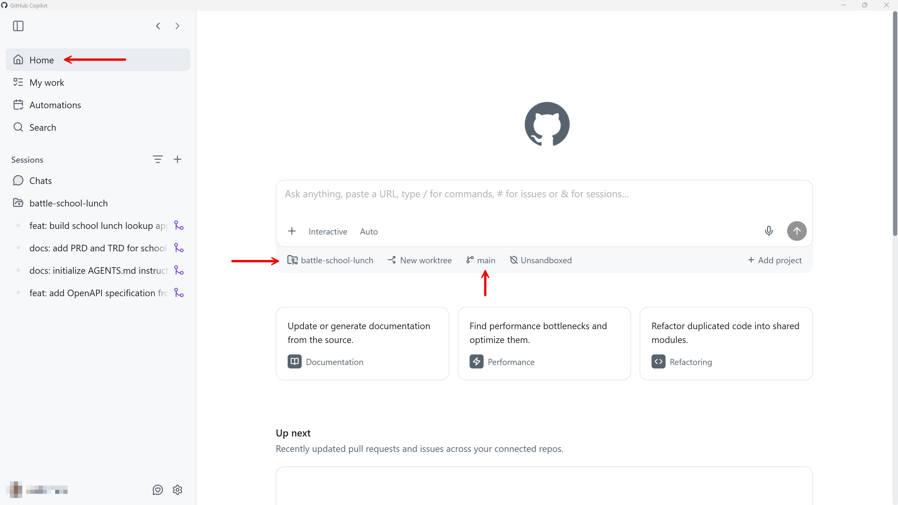
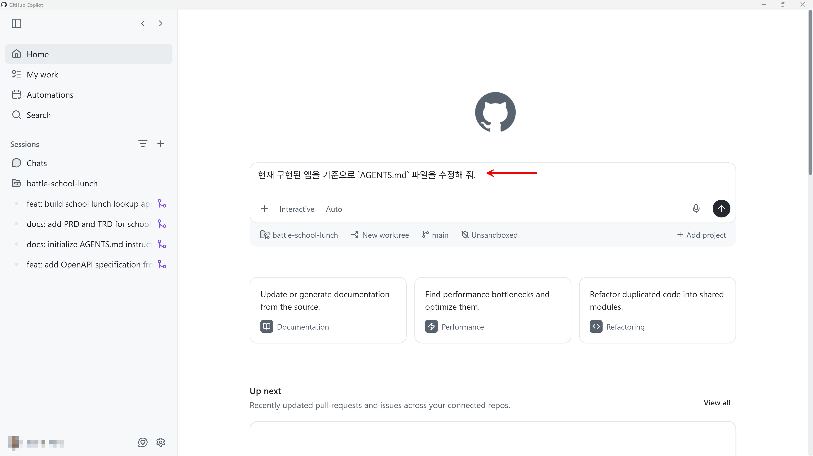

# `AGENTS.md` 문서 수정하기

앱 구현이 끝났다면, 이와 관련한 PRD와 TRD 문서도 수정이 되었을 것입니다. 이후 마찬가지로 `AGENTS.md` 파일도 구현된 앱과 PRD, TRD에 맞춰 수정해야 합니다.

이 세션에서는 `AGENTS.md` 파일을 현재까지 개발된 앱을 기준으로 수정하도록 합니다.

> [!NOTE]
> 현재 보이는 스크린샷은 시간이 지나면서 UI 업데이트로 인해 현재 시점과 다를 수 있습니다.

## 직접 프롬프트 입력하기

1. Copilot app의 "Home" 탭에서 리포지토리가 현재 작업하고 있는 리포지토리인지, 브랜치는 `main` 브랜치인지 확인합니다.

   

1. 아래와 같이 프롬프트를 입력합니다.

    ```text
    현재 구현된 앱을 기준으로 `AGENTS.md` 파일을 수정해 줘.
    ```

   

1. 수정 결과를 확인합니다. 필요한 경우 추가로 더 수정합니다.
1. "Create PR" 버튼을 클릭하여 변경 사항을 PR로 생성한 후 머지합니다.
1. 머지가 완료된 것을 확인합니다.

---

`AGENTS.md` 파일을 수정했습니다. [Azure에 앱 배포하기](./06-deplopy-to-azure.md)로 넘어가세요.
