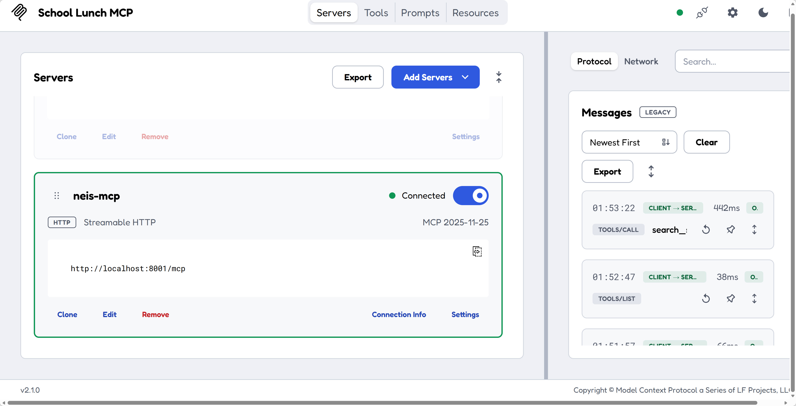

# MCP 서버 구현하기

앞서 NEIS에서 제공하는 공개 API를 백엔드 API에 통합시켰습니다. 하지만, 이 백엔드 API는 AI 에이전트가 활용하기에는 적절하지 않습니다. 이 세션에서는 NEIS API를 MCP 서버로 만들어 봅니다.

> [!NOTE]
> 현재 보이는 스크린샷은 시간이 지나면서 UI 업데이트로 인해 현재 시점과 다를 수 있습니다.

## 이슈 확인하기

1. Copilot app의 "My work" 탭에서 현재 열려있는 모든 이슈를 확인한 후 그 중 "MCP 서버 개발하기" 이슈를 클릭합니다.
1. 이슈의 내용과 이슈를 클로징하기 위해 필요한 인수 조건을 확인합니다.

## 세션 생성하기

1. 오른쪽 위의 "New session" 버튼을 클릭합니다.
1. 이 이슈를 근거로 하는 새로운 세션이 만들어졌습니다. 그리고 이 세션은 새로운 worktree를 기반으로 동작합니다. 따라서 기존의 코드베이스와 충돌하지 않습니다.

## 이슈 작업하기

1. 아래와 같이 프롬프트를 입력한 후 에이전트를 실행시킵니다.

    ```text
    이슈의 내용을 구현해 줘. 공식 MCP SDK를 사용하고 1.x 버전을 사용해 줘. 작업 과정에서 `PRD.md`와 `TRD.md` 문서의 수정이 필요하다면 함께 수정해 줘. 마찬가지로 `AGENTS.md` 문서의 수정이 필요하다면 함께 수정해 줘.
    ```

1. 작업이 끝나면 MCP 서버 앱이 만들어집니다.
1. 아래 프롬프트를 이용해 MCP 서버 실행 방법과 테스트 방법을 알아냅니다.

    ```text
    MCP 서버 실행 명령어를 알려줘. 그리고 MCP 서버 인스펙터 실행 명령어도 알려줘.
    ```

1. MCP 서버를 실행시키고 다음에 MCP 인스펙터를 실행시킵니다.

   

1. 동작하는 MCP 서버를 인스펙터로 검토하면서 수정이 필요하거나 추가할 내용이 있을 경우 프롬프트를 통해 해결합니다.
1. 아래 프롬프트를 통해 MCP 서버도 Azure 클라우드에 배포 가능하도록 합니다. 필요하다면 `/azure-prepare`, `/azure-deploy` 스킬을 명시적으로 사용하는 것도 좋습니다.

    ```text
    기존 bicep 파일을 수정해서 MCP 서버도 배포할 수 있게 해줘.
    ```

1. 만족할 때 까지 수정한 후, 오른쪽 위의 "Create PR" 버튼을 클릭해서 방금 작업한 내용을 바탕으로 PR을 생성합니다.
1. PR이 만들어졌고, 머지할 준비가 끝났습니다. "Ready to merge" 버튼을 클릭합니다.
1. 새 팝업 모달 창이 나타나면 "Merge pull request" 버튼을 클릭해서 방금 생성한 PR을 머지합니다.
1. 머지가 완료된 것을 확인합니다.

---

MCP 서버를 구현했습니다. [에이전트 분석 평가 항목 정의하기](./09-define-evaluation-rubric.md)로 넘어가세요.
