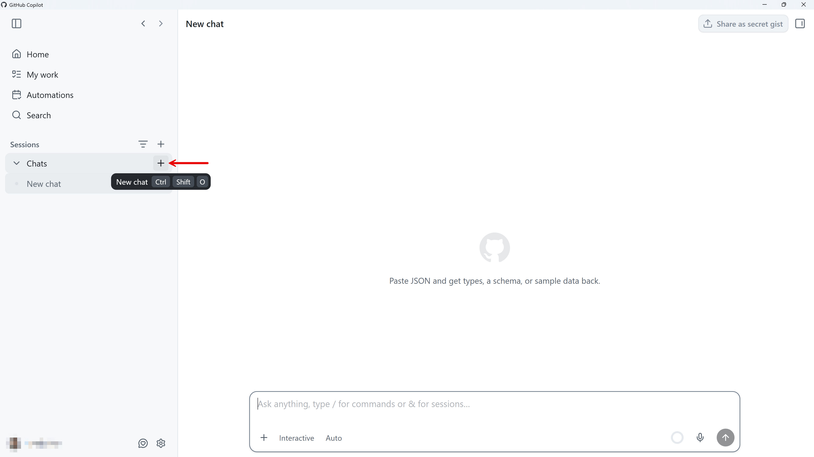
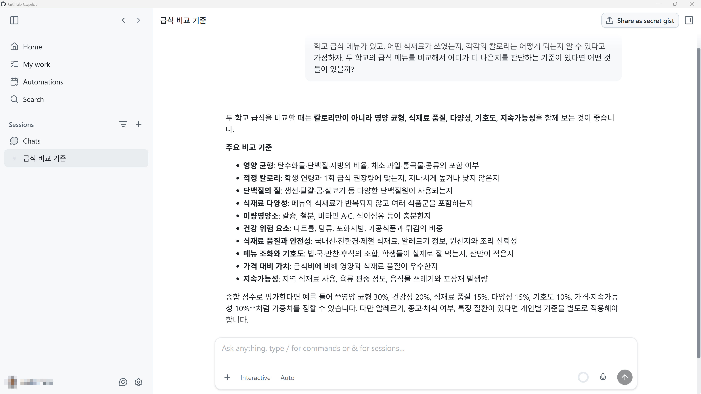
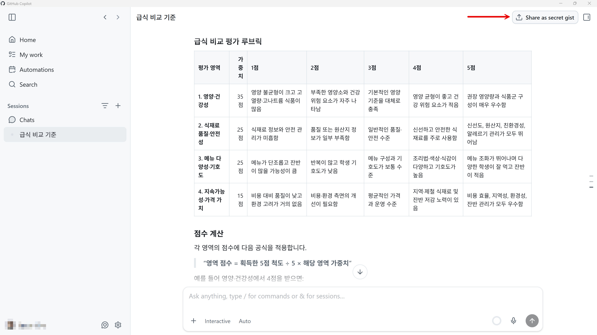
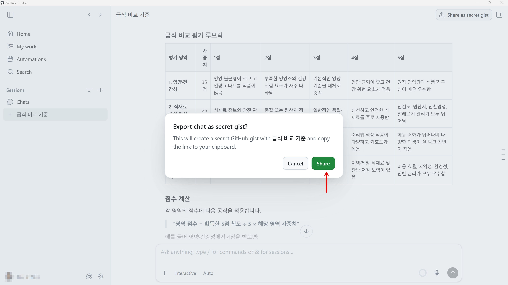
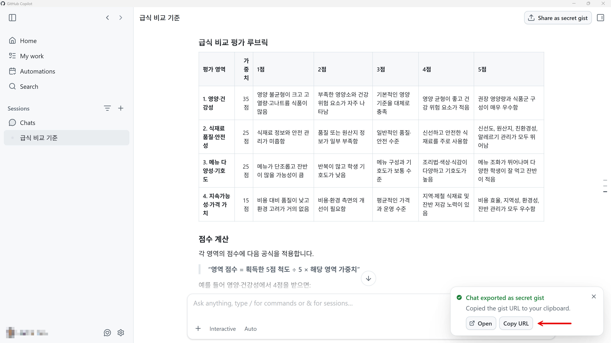
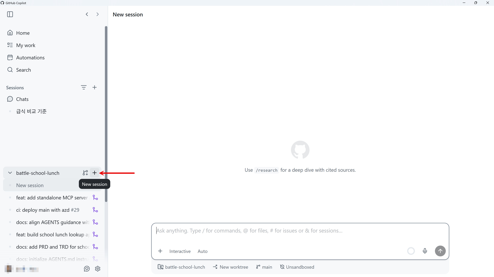

# 에이전트 분석 평가 항목 정의하기

멀티 에이전트 시스템을 구축하기 전, AI 에이전트가 급식 메뉴 정보를 통해 분석할 수 있는 평가 항목을 먼저 정의해야 합니다. 이 세션에서는 GitHub Copilot app의 채팅 기능을 통해 평가 항목을 정의하고, 이를 파일로 저장합니다.

> [!NOTE]
> 현재 보이는 스크린샷은 시간이 지나면서 UI 업데이트로 인해 현재 시점과 다를 수 있습니다.

> [!TIP]
> 이미 `EVALUATION_RUBRIC.md` 문서를 참고용으로 제공하고 있습니다. 이 파일을 그대로 쓰려면 이 세션은 건너뛰어도 됩니다.

> [!CAUTION]
> 만약 새로 생성하고 싶다면 참고용으로 제공한 `EVALUATION_RUBRIC.md` 파일을 먼저 삭제한 후 시작하세요. 그렇지 않을 경우 원하는 결과가 나오지 않을 수도 있습니다.

## 채팅 이용해서 문제 분석하기

1. Copilot app의 왼쪽 "Chats" 메뉴에서 "+" 버튼을 클릭해서 새 채팅창을 생성합니다.

   

1. 평가 기준에 대해 전혀 아는 바가 없으므로 우선 채팅창에 대략 아래와 비슷한 내용으로 대화를 시작합니다.

    ```text
    학교 급식 메뉴가 있고, 어떤 식재료가 쓰였는지, 각각의 칼로리는 어떻게 되는지 알 수 있다고 가정하자. 두 학교의 급식 메뉴를 비교해서 어디가 더 나은지를 판단하는 기준이 있다면 어떤 것들이 있을까?
    ```

   그러면 대략 아래와 비슷한 응답을 받을 겁니다. 물론 전혀 다른 답이 나올 수도 있습니다.

   

1. 점점 대화를 좁혀갑니다. 아래와 비슷한 프롬프트를 던져봅니다.

    ```text
    만약, 당신이 평가위원이라면 어떤 평가 항목으로 총점 100점 만점의 루브릭을 구성할지 말해줘.
    ```

1. 평가 항목의 갯수가 너무 많거나 너무 적으면 아래와 같이 프롬프트를 이용해서 3개-5개 항목으로 구성해 달라고 합니다.

    ```text
    평가 영역을 3가지/4가지/5가지 정도로 조정하고 각 평가영역별 5점 척도로 구분해서 가중치와 함께 구성해 줘.
    ```

1. 평가 영역별 루브릭 결과가 만족스러우면 secret gist로 공유합니다.

   

   

   secret gist 공유 URL을 아래와 같이 복사합니다.

   

## 직접 프롬프트 입력하기

1. Copilot app 왼쪽의 리포지토리 옆에 있는 "+" 버튼을 클릭해서 새 세션을 생성합니다.

   

1. 아래와 같은 프롬프트를 입력해서 루브릭을 저장합니다. 앞서 복사한 gist 링크를 활용합니다.

    ```text
    https://gist.github.com/... 내용은 급식 평가 항목 관련 루브릭이야. 이 내용을 바탕으로 `EVALUATION_RUBRIC.md` 파일을 생성해 줘. 이 파일에는 이 루브릭의 목적, 각 평가 항목별 루브릭, 평가하지 않는 것 등이 포함되어야 해. 각 평가 항목 하나당 AI 에이전트 하나가 할당될 것을 전제로 해줘. 필요하다면 전체를 정리하는 최종 평가 항목도 추가하면 좋아.
    ```

1. 만들어진 루브릭을 검토합니다. 필요한 경우 추가 프롬프트를 통해 수정합니다.
1. 만족할 때 까지 수정한 후, 오른쪽 위의 "Create PR" 버튼을 클릭해서 방금 작업한 내용을 바탕으로 PR을 생성합니다.
1. PR이 만들어졌고, 머지할 준비가 끝났습니다. "Ready to merge" 버튼을 클릭합니다.
1. 새 팝업 모달 창이 나타나면 "Merge pull request" 버튼을 클릭해서 방금 생성한 PR을 머지합니다.
1. 머지가 완료된 것을 확인합니다.

---

에이전트 평가 항목을 정의했습니다. [멀티 에이전트 워크플로우 구현하기](./10-implement-agent-workflow.md)로 넘어가세요.
